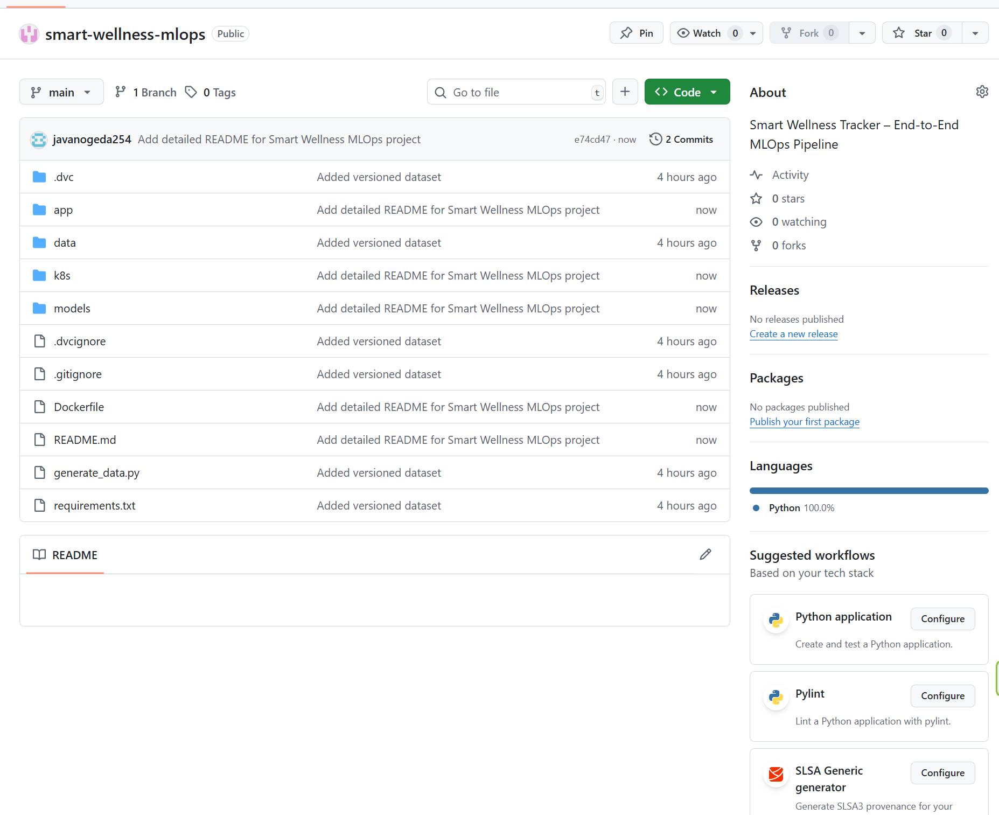

# 🧠 Smart Wellness Tracker – End-to-End MLOps Project (Local Setup with MinIO + K8s)

> Predict wellness scores using simulated IoT health data (heart rate, sleep hours, step count) through a fully containerized, orchestrated, and monitored MLOps pipeline.

## 🚀 Project Highlights

✅ Data versioning using **DVC**  
✅ MinIO as the **S3-compatible object store**  
✅ Training + experiment tracking via **MLflow**  
✅ Model orchestration with **Prefect**  
✅ **Docker**-based containerization  
✅ **FastAPI** model serving  
✅ **Local Kubernetes (Minikube)** for production-like deployment  
✅ Real-time monitoring with **Prometheus + Grafana**

---

## 🏗️ Architecture Diagram


---

## 📁 Project Structure

smart-wellness-mlops/
│
├── app/
│ ├── main.py # FastAPI app
│ └── train.py # Training + MLflow logging
│
├── data/ # Raw DVC versioned data
├── models/ # Saved models (joblib)
├── pipelines/ # (Optional) Prefect flows
├── k8s/
│ └── deployment.yaml # K8s deployment + service
├── Dockerfile # FastAPI container
├── generate_data.py # Simulate IoT health data
├── requirements.txt
├── dvc.yaml
├── mlruns/ # Local MLflow tracking
└── README.md


---

## ⚙️ Tools Used

| Category             | Tools                                              |
|----------------------|----------------------------------------------------|
| Version Control      | Git + GitHub                                       |
| Data Versioning      | DVC + MinIO (via S3 protocol)                      |
| Experiment Tracking  | MLflow (local file system backend)                |
| ML Framework         | scikit-learn                                       |
| Serving              | FastAPI + Uvicorn                                  |
| Containerization     | Docker                                             |
| Deployment           | Local Kubernetes (Minikube or Docker Desktop)      |
| Monitoring           | Prometheus + Grafana                               |
| Workflow Orchestration | Prefect (Optional)                              |

---

## 🧪 Setup & Run Locally

### 1️⃣ Clone & Setup Virtual Env

```bash
git clone https://github.com/YOUR_USERNAME/smart-wellness-mlops.git
cd smart-wellness-mlops
python -m venv .venv
source .venv/bin/activate
pip install -r requirements.txt


2️⃣ Run MinIO Locally
bash
Copy
Edit
docker run -p 9000:9000 -p 9001:9001 \
  -e "MINIO_ROOT_USER=minioadmin" \
  -e "MINIO_ROOT_PASSWORD=minioadmin" \
  quay.io/minio/minio server /data --console-address ":9001"
Access: http://localhost:9001
Login: minioadmin / minioadmin

Create bucket: mlops-data

3️⃣ Configure DVC + MinIO
bash
Copy
Edit
dvc init
dvc remote add -d minio_remote s3://mlops-data
dvc remote modify minio_remote endpointurl http://localhost:9000
dvc remote modify minio_remote access_key_id minioadmin
dvc remote modify minio_remote secret_access_key minioadmin

4️⃣ Generate & Push Data
bash
Copy
Edit
python generate_data.py
dvc add data/wellness_data.csv
git add data/*.dvc .gitignore dvc.yaml
git commit -m "Add versioned wellness data"
dvc push

5️⃣ Train Model + Log with MLflow
bash
Copy
Edit
python app/train.py
mlflow ui  # Visit http://127.0.0.1:5000

6️⃣ Build & Run FastAPI App
bash
Copy
Edit
docker build -t wellness-api .
docker run -p 8000:8000 wellness-api
Sample Prediction
bash
Copy
Edit
curl -X POST http://localhost:8000/predict \
-H "Content-Type: application/json" \
-d '{"heart_rate": 78, "sleep_hours": 7.5, "steps": 9000}'

7️⃣ Deploy to Local Kubernetes
bash
Copy
Edit
minikube start
minikube image load wellness-api:latest
kubectl apply -f k8s/deployment.yaml
minikube service wellness-service


8️⃣ Monitor with Prometheus + Grafana
bash
Copy
Edit
helm repo add prometheus-community https://prometheus-community.github.io/helm-charts
helm repo update
helm install monitor prometheus-community/kube-prometheus-stack
kubectl port-forward svc/monitor-grafana 3000:80
Visit: http://localhost:3000
Login: admin / prom-operator

